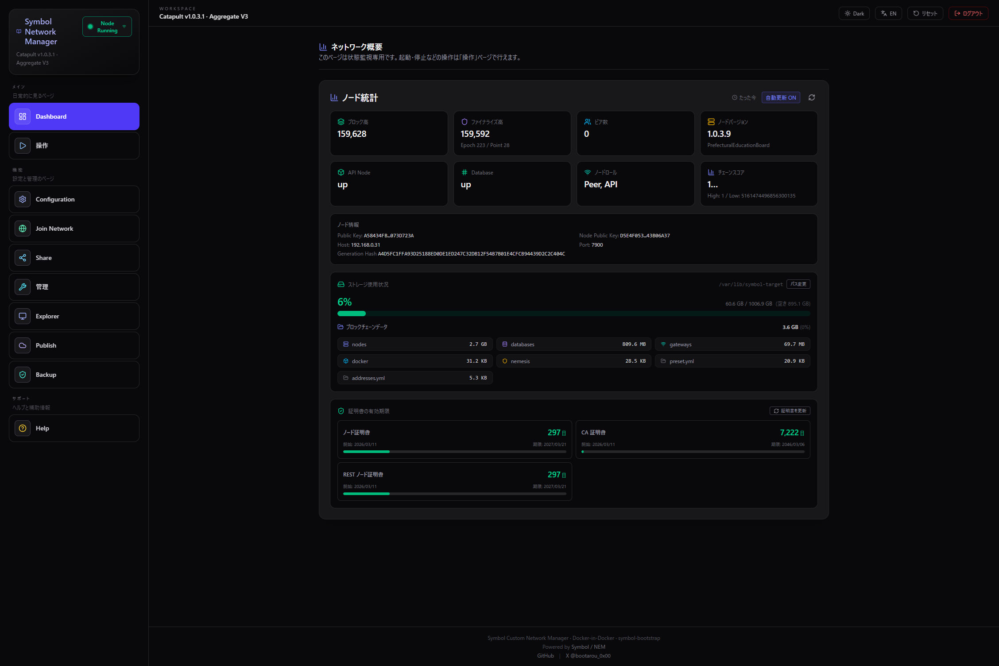

# Symbol Network Manager

Symbol ブロックチェーンのカスタムネットワーク（プライベートネットワーク）を Web UI で構築・管理するブロックチェーン-ネットワーク-ランチャー(BNL)です。


## 概要

Docker コンテナ 1 つを起動するだけで、Symbol ノードの設定・起動・停止・監視がすべてブラウザから操作できます。

- 🖥️ **Web UI** — React + Tailwind CSS によるモダンなダッシュボード
- 🔧 **ノード管理** — 起動 / 停止 / 再起動 / フルリセットをワンクリック
- 🌐 **ネットワーク参加** — Seed ファイルのインポートでカスタムネットワークへ、または公式ネットワーク（mainnet / testnet）へ参加
- 📊 **リアルタイム監視** — ブロック高・ファイナリティ高・ピア数・ハーベスト状態・ネットワーク通貨を表示
- 📜 **ターミナルログ** — Docker コンテナログを WebSocket でリアルタイム表示
- 🔑 **アドレス管理** — ノードのアドレス・公開鍵をワンクリックでコピー
- 💾 **バックアップ / リストア** — 設定のみ / フル（ブロックデータ含む）の 2 種類の zip バックアップに対応
- 🔍 **Explorer** — Symbol Explorer をビルド・起動して自ネットワークのブロックを閲覧
- ☁️ **ネットワーク公開** — Cloudflare 連携でノードをインターネットに公開
- 🔒 **ログイン認証** — `ADMIN_PASSWORD` を設定するとパスワード保護を有効化
- 🌍 **多言語対応** — 日本語 / English 切り替え
- 🌙 **ダーク / ライトテーマ** — 好みに応じて切り替え

## スクリーンショット

最新 UI のイメージです。



## アーキテクチャ

```
┌─────────────────────────────────────────────────────┐
│  symbol-manager コンテナ                            │
│                                                     │
│  ┌─────────────┐      ┌──────────────────┐         │
│  │  Frontend    │      │  Backend         │         │
│  │  React       │◄────►│  Express + WS    │         │
│  │  Vite :5173  │      │  :4000           │         │
│  └─────────────┘      └──────┬───────────┘         │
│                              │ docker.sock          │
└──────────────────────────────┼──────────────────────┘
                               ▼
                  ┌────────────────────────┐
                  │  symbol-bootstrap      │
                  │  (sibling containers)  │
                  │                        │
                  │  api-node-0  :7900     │
                  │  rest-gateway :3000    │
                  │  broker               │
                  │  db (MongoDB)         │
                  └────────────────────────┘
```

## 必要環境

| 要件 | バージョン |
|------|-----------|
| **Docker** | 20.10 以上 |
| **Docker Compose** | v2 以上 |
| **OS** | Windows / macOS / Linux |
| **メモリ** | 8 GB 以上推奨 |
| **ディスク** | 20 GB 以上の空き容量 |

> 💡 **推奨**: ネイティブ Linux + Docker Engine（Docker Desktop 不要）

## クイックスタート

### 1. リポジトリをクローン

```bash
git clone https://github.com/bootarou/blockchain-network-launcher.git
cd blockchain-network-launcher
```

### 2. 環境設定ファイルを作成（任意）

```bash
cp .env.example .env
```

デフォルト設定のままでも起動できます。以下を変更したい場合のみ `.env` を編集してください。

- `SYMBOL_TARGET_DIR` — ブロックチェーンデータの保存先（大容量ディスクに変更する場合）
- `ADMIN_PASSWORD` — 設定すると Web UI にログイン認証がかかります
- `BIND_ADDRESS` — デフォルトは `127.0.0.1`（ローカルのみ）。LAN や他 PC からアクセスする場合は `0.0.0.0` に変更（`ADMIN_PASSWORD` との併用推奨）

### 3. Docker イメージをビルド

```bash
docker compose build
```

> ⚠️ **Docker Compose v2.34+** (Docker Desktop 4.45+) では Bake がデフォルト有効になり、ビルドが失敗する場合があります。その場合：
>
> **PowerShell:**
> ```powershell
> $env:COMPOSE_BAKE="false"; docker compose build
> ```
> **Linux / macOS:**
> ```bash
> COMPOSE_BAKE=false docker compose build
> ```

### 4. コンテナを起動

```bash
docker compose up -d
```

### 5. ブラウザでアクセス

```
http://localhost:5173
```

> 💡 デフォルトでは `127.0.0.1` にのみバインドされるため、同じマシンからしかアクセスできません。他の PC からアクセスする場合は `.env` で `BIND_ADDRESS=0.0.0.0` を設定してください。
> `ADMIN_PASSWORD` を設定している場合は、初回アクセス時にログイン画面が表示されます。

## 使い方

### 新規ネットワーク構築（Nemesis ノード）

1. **Configuration** タブで Assembly = `dual`、Preset = `bootstrap` を選択
2. ホスト IP、フレンドリーネーム等を設定
3. **Start** で起動（設定は自動保存されます）— ネメシスブロックが生成されノードが起動

### 既存ネットワークに参加

1. **Join Network** タブでソースノードの REST API URL を入力
2. **Import Seed File** でネットワーク管理者から受け取った Seed ファイルをインポート
3. **Configuration** タブで設定を確認 → 操作ページで **Start**（設定は自動保存されます）

### 公式ネットワーク（mainnet / testnet）に参加

1. **Join Network** タブで既知ノード（mainnet / testnet）を選択、または REST API URL を入力して設定を取り込み
2. **Configuration** タブで設定を確認 → 操作ページで **Start**（設定は自動保存されます）

公式ネットワークでは Seed ファイルは不要です。ネットワーク設定は自動で取得されます。

### ネットワーク共有（他ノードの招待）

1. **Share Network** タブで Seed ファイルをダウンロード
2. 参加者に Seed ファイルと REST API URL を配布

### バックアップ / リストア

1. **Backup** タブで「設定のみ」または「フル（ブロックデータ含む）」を選んで zip をダウンロード
2. リストアは zip をアップロードするだけ。復元後は画面が自動で再読み込みされます

詳細な手順・注意事項は [docs/backup-restore.md](docs/backup-restore.md) を参照してください。

### Explorer / ネットワーク公開

- **Explorer** タブで Symbol Explorer をビルド・起動し、自ネットワークのブロックやトランザクションをブラウザで閲覧できます（デフォルトポート: `8090`）
- **Publish** タブで Cloudflare（API トークン・Zone ID・Account ID）を設定すると、ノードをインターネットに公開できます

詳しい操作手順は [MANUAL.md](MANUAL.md) を参照してください。

## プロジェクト構成

```
├── backend/
│   ├── server.ts          # Express API + WebSocket サーバー
│   └── package.json
├── frontend/
│   ├── src/
│   │   ├── App.tsx         # メインアプリケーション
│   │   ├── components/     # React コンポーネント
│   │   ├── i18n/           # 多言語リソース (ja/en)
│   │   ├── lib/            # API クライアント・ユーティリティ
│   │   └── theme/          # テーマ管理
│   ├── index.html
│   └── vite.config.ts
├── shared/
│   └── custom-preset.yml   # symbol-bootstrap カスタムプリセット
├── docs/
│   ├── backup-restore.md   # バックアップ/リストア手順書
│   └── screenshots/        # スクリーンショット
├── .env.example            # 環境設定のテンプレート
├── docker-compose.yml
├── Dockerfile
├── start.sh                # コンテナ起動スクリプト
└── MANUAL.md               # ユーザーマニュアル
```

## 技術スタック

### Frontend

- **React 19** + **TypeScript**
- **Vite** — 高速ビルド & HMR
- **Tailwind CSS 4** — ユーティリティファーストCSS
- **Lucide React** — アイコン
- **WebSocket** — リアルタイムログ・ステータス更新

### Backend

- **Node.js 20** + **TypeScript** (tsx)
- **Express 5** — REST API
- **WebSocket (ws)** — ターミナルログ配信
- **symbol-bootstrap** — ノード構成・起動管理
- **Docker CLI** — サイドカーコンテナ操作 (DinD パターン)

## 環境変数

`.env` ファイル（`.env.example` をコピーして作成）で設定します。

| 変数 | デフォルト | 説明 |
|------|-----------|------|
| `SYMBOL_TARGET_DIR` | `/var/lib/symbol-target` | symbol-bootstrap のターゲットディレクトリ（ブロックデータ保存先） |
| `ADMIN_PASSWORD` | （空 = 認証なし） | Web UI の管理パスワード。設定するとログイン認証が有効化 |
| `BIND_ADDRESS` | `127.0.0.1` | Web UI ポート (4000, 5173) のバインドアドレス。`0.0.0.0` で LAN / リモートからアクセス可 |
| `SYMBOL_BOOTSTRAP_REPO` | `https://github.com/bootarou/symbol-bootstrap.git` | symbol-bootstrap の Git リポジトリ URL（ビルド時） |
| `NODE_ENV` | `development` | 実行環境 |
| `PORT` | `4000` | バックエンド API ポート |

## ポート一覧

| ポート | 用途 |
|--------|------|
| `5173` | Frontend (Vite dev server) — `BIND_ADDRESS` にバインド（デフォルト: ローカルのみ） |
| `4000` | Backend API & WebSocket — `BIND_ADDRESS` にバインド（デフォルト: ローカルのみ） |
| `3000` | Symbol REST Gateway (symbol-bootstrap が管理) |
| `7900` | Symbol P2P ノード (symbol-bootstrap が管理) |
| `8090` | Symbol Explorer（Explorer 起動時のデフォルト、変更可） |

## ドキュメント

- [MANUAL.md](MANUAL.md) — 詳細なユーザーマニュアル（Docker Host Mode、nodeEqualityStrategy、トラブルシューティング等）
- [docs/backup-restore.md](docs/backup-restore.md) — バックアップ / リストア手順書（バックアップの種類、ケース別の復元動作、注意事項）
- [docs/wsl-lan-setup.md](docs/wsl-lan-setup.md) — WSL2 ホストの LAN 公開手順書（mirrored モード / portproxy、ファイアウォール設定）

## ライセンス

ISC
